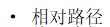

# MarkDown常用语法

- 标题相关：

> 一级标题: `` #`` 
>
> 二级标题：``##``
>
> 三级标题：``###``

- 标号相关：

> 有序的直接用序号加点，无序的用-
>
> 1. 第一级
>    1. 第二级

- 文字相关：

> 加粗：``**（加粗字体）**``**（加粗）**
>
> 倾斜：``_（倾斜字体）_``_（倾斜）_
>
> 加粗倾斜：``**_（加粗倾斜）_**``**_（加粗倾斜）_**
>
> 删除线：``~~(删除线)~~``~~(删除线)~~

- 代码块：

> 单行代码块：`代码块`

```c
多行代码块
```

- 超链接：

[名字]（url）网页：

[baidu](http://www.baidu.com)

图片：


- 其他：

>分割线 ：---
>
>---
>
>表格：| | |
>
>| 1    | 2    |
>| ---- | ---- |
>|      |      |
>
>引用： >
>
>>

- 路径：

> 相对路径：

> 绝对路径：

