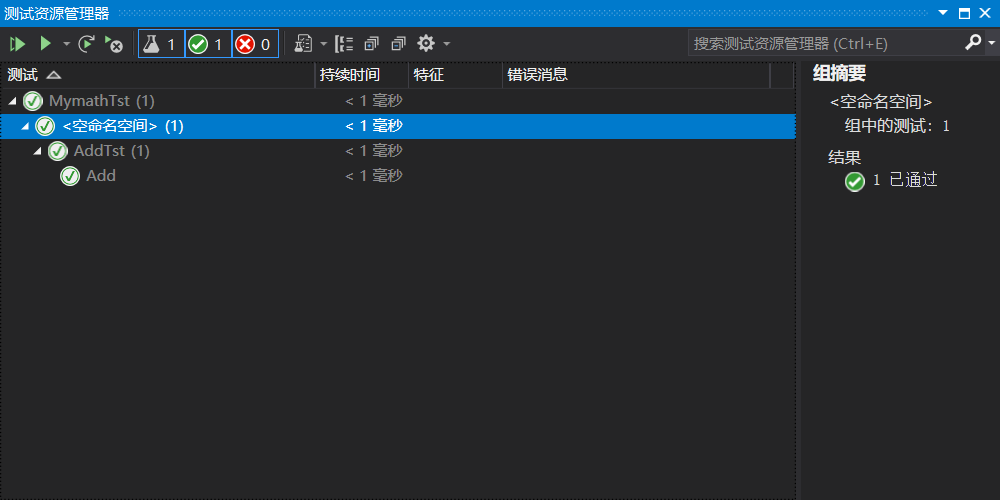

# 单元测试

- 单元测试创建：

> 通过VS2019创建新的GTest工程。

- 代码覆盖度：

> 代码覆盖度就是运行测试之后，代码被覆盖到了多少，哪些代码跑了，哪些没有跑。

- 运行性能：

> 
>
> 此处就是该单元的运行性能。

- 测试样例书写：

> ```c
> #include "pch.h"
> 
> int Add(int a, int b) {//待测试单元函数
>     return a + b;
> }
> 
> TEST(AddTst, Add) {//测试进程（类名，测试名）
>   EXPECT_EQ(Add(3,4), 7);//测试函数输出是否满足预期
>   EXPECT_TRUE(true);//
> }
> ```

- 单元测试的调试

> 调整比较的结果，检查不同结果的影响。

==断言==和==期望==

断言``ASSERT_``不通过检查则中断测试、期望`EXPECT_`不通过检查并不中断测试。

| 后缀      | 参数      | 通过条件        |
| --------- | --------- | --------------- |
| TRUE      | ©         | c == true       |
| FALSE     | ©         | c == false      |
| EQ        | (a, b)    | a == b          |
| NE        | (a, b)    | a != b          |
| LT        | (a, b)    | a < b           |
| LE        | (a, b)    | a <= b          |
| GT        | (a, b)    | a > b           |
| GE        | (a, b)    | a >= b          |
| FLOAT_EQ  | (a, b)    | float型 a ≈ b   |
| DOUBLE_EQ | (a, b)    | double型 a ≈ b  |
| NEAR      | (a, b, e) | abs(a - b) <= e |

[[C++\] gtest入门教程](https://blog.csdn.net/jkddf9h8xd9j646x798t/article/details/105964161)

- 使用运行测试：

> 将配置类型改为动态库(.dll)，之后右键该工程，点击运行测试。
>
> 

