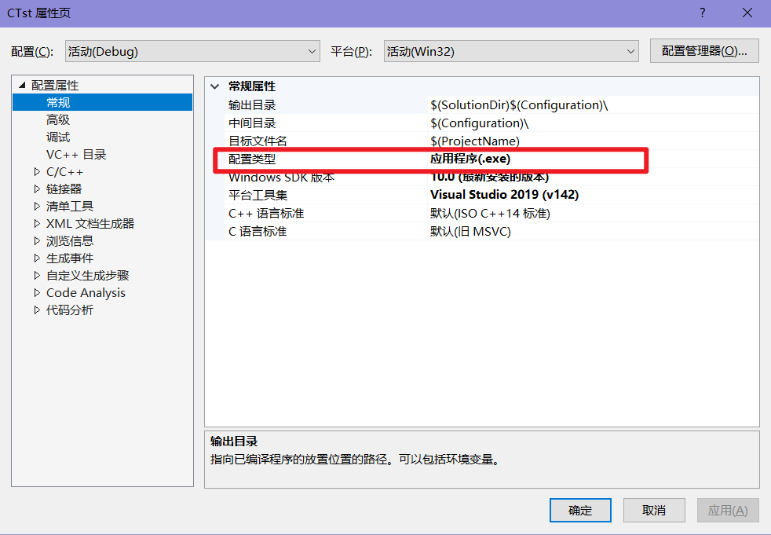
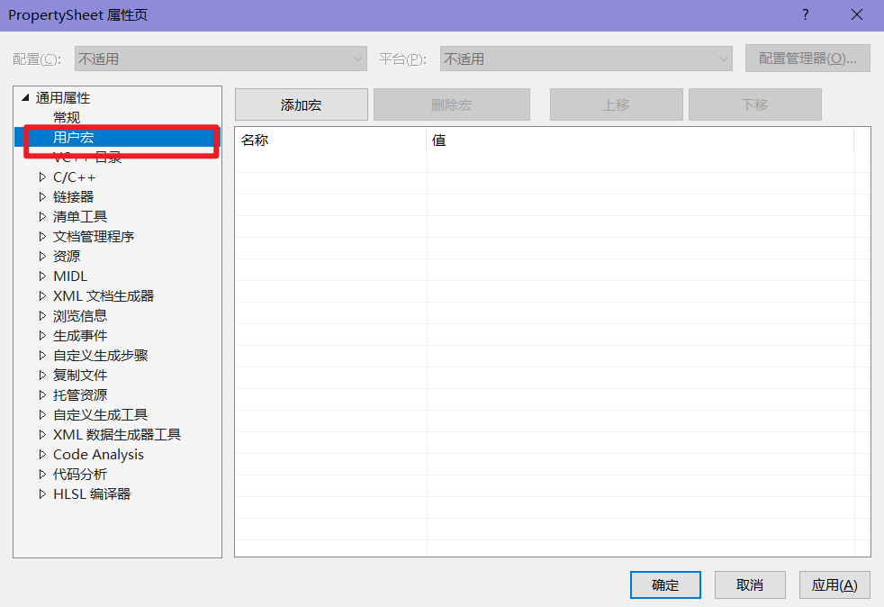
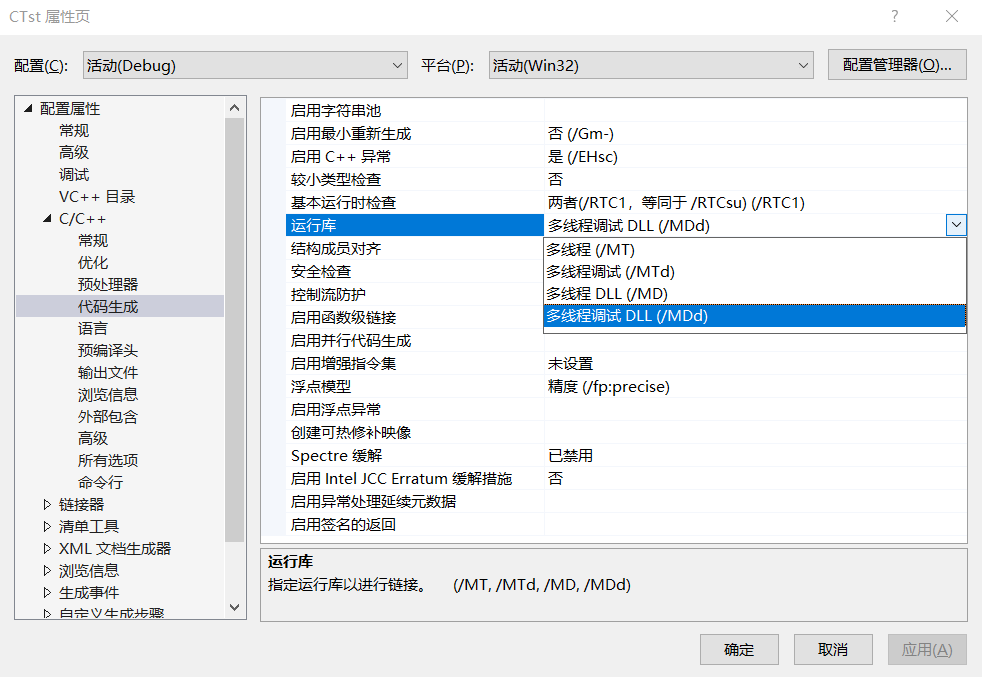
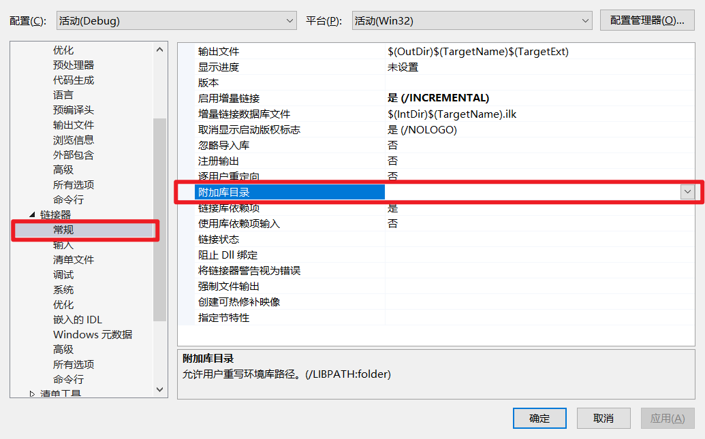
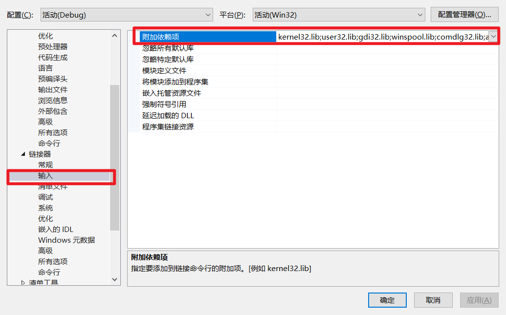
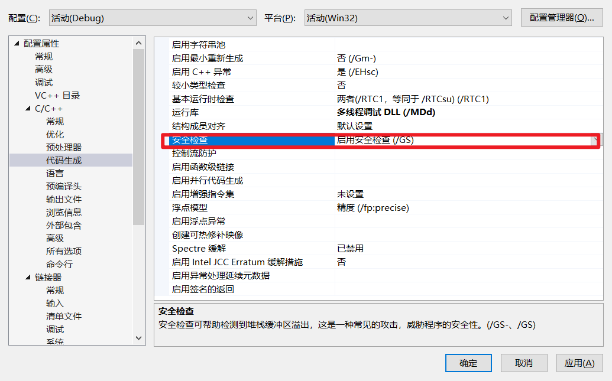

# VisualStudio

## 工程配置：

> 解决方案配置：
>
> 平台配置：
>
> 项目类型配置：

- ==宏定义==

> 用户宏：在属性管理器创建属性
>
> 
>
> 预处理器宏：
>
> 
>
> 此处可以查询已经定义的宏。

- ==运行库：==

> 
>
>     MT是静态编译，将项目使用的库链接到生成文件中，不需要使用外部提供的dll；
>     MD是动态编译，在使用目标文件，需要额外提供dll等依赖文件；

- ==调用库：==

> 首先添加附加库目录：
>
> 
>
> 
>
> 之后在链接器这里填写上附加库目录和依赖项。

- ==安全检查：==

> 

## 工程调试

- ==断点：==

> 右键断点就可以进行对断点的属性配置。

- ==窗口：==

> 点开Debug界面：
>
> 

- ==单步调试：==

> 
>
> 依次是，全速调试，停止，复位，显示下一句，逐语句，逐过程，跳出